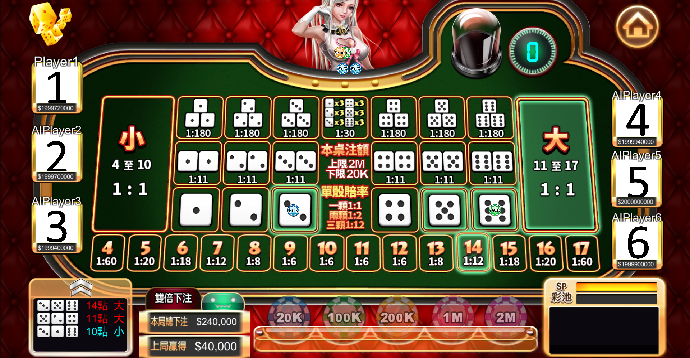

# Sic-Bo Mobile Game Prototype

This is a prototype Sic Bo (骰寶) gambling game designed with Unity 2018.4.19f1 and C#. I developed this game's prototype during my first internship in a game dev studio.

The mobile game should be cross compatible with iOS and Android. This demo includes a compiled Android .apk file for testing. 

Source code is not included due to contractual reasons.

## Screenshots

